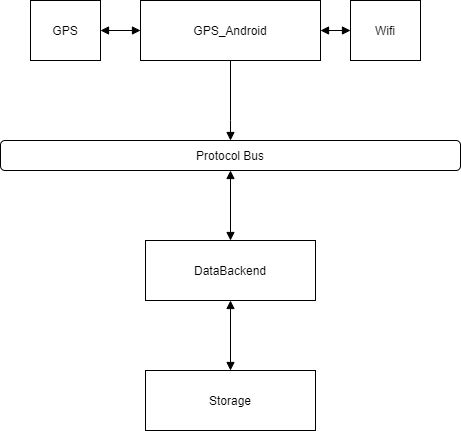

# Context and Scope

The **GPS_Tracker** set of projects intended to be used for the optimization of mobile users' signals. Optimization aims to find the best positions for the base stations represented by the UAVs.

## Business context

There are three types of actors:

1. Mobile Connection Users - the volunteers that allowed to install the special software GPS_Android on their mobile phones. They are connected to the access points provided by the network which efficiency we seek to increase.
2. Operators - the owners of the mobile network who are interested in the increased network throughput. They want to optimize either technical characteristics of the radio technologies or optimize the layout of the access points.
3. Researchers - scientific guys who want to test the layout optimization algorithms on the telemetry data from mobile connection users. They also can consult Operators what how to exactly treat the information provided by **GPS_Tracker**.

Also, that is worth describing the activities performing in the system. There are three important use-cases:

1. User interaction via **GPS_Frontend** - **GPS_Frontend** is a web application that allows users to interact with the backend to fetch and observe information stored. Also, there is a purpose to filter data and run optimization tasks.
2. Sending telemetry data via **GPS_Frontend* - each mobile connection user has GPS_Android installed on the phones. That is an important part of the software because it provides the real info on the radio network quality attributes.
3. Operating with **GPS_Tracker** - **GPS_Tracker** is a set of the program running in the backend that performs a lot of processing operations to serve the user requests. No direct interaction from the actors required.

Also, there are other activities included in or to extend these three use-cases:

|Use-case|Description|
|---|------|
|Signal Quality Metrics Observation| Each telemetry message from the mobile connection users includes information about the location and current wireless connection RSS. That information is shown via different figures available in the UI.|
|Client Channel Throughput Analysis| Each client performs uplink and downlink throughput evaluation. These throughput evaluation drawn are to be observed and analyzed in **GPS_Frontend*.|
|Testing Placement Algorithms| There is a simple and extensible approach on how to add additional optimization algorithms to test. There is a unified interface to access telemetry data.|
|Running Optimization Tasks| **GPS_Tracker** can run several optimizations in parallel. The researches can compare the results of different algorithms.|
|Persistent storage| The telemetry from the users as well as optimization task results are saved persistently in well-known JSON format. Further, the data can be imported in other analytic tools.|
Table: Main use-cases description

## Technical context

The following diagrams show the input/output interfaces for the main components.

{width=50%}
