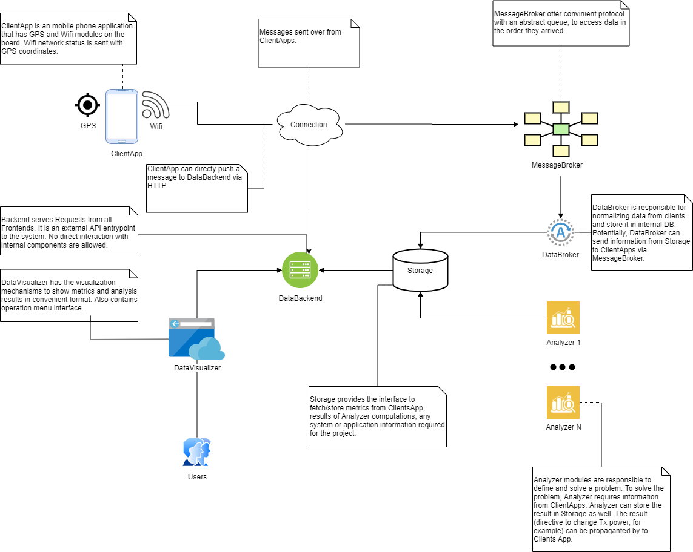

# Possible usage scenario

Conceptually, the GPS_Tracker framework consists of several abstract components

|Component|Description|
|---|---|
|Analyzer| An special entity that perform ETL operations on the data provided by ClientApp.|
|ClientApp|An entity  installed on the user's phones that send information from the sensors.|
|MessageBroker|Protocol that the data from sensors is sent over.|
|DataBroker| A sensor data receiver part. The terminating side of MessageBroker. |
|DataBackend|A component that provide an data access methods for the end clients. |
|DataVisualizer| An entity the user interacts with.|
|Storage|A program that stores sensor data reliably and has a well-defined access interface.|

 
