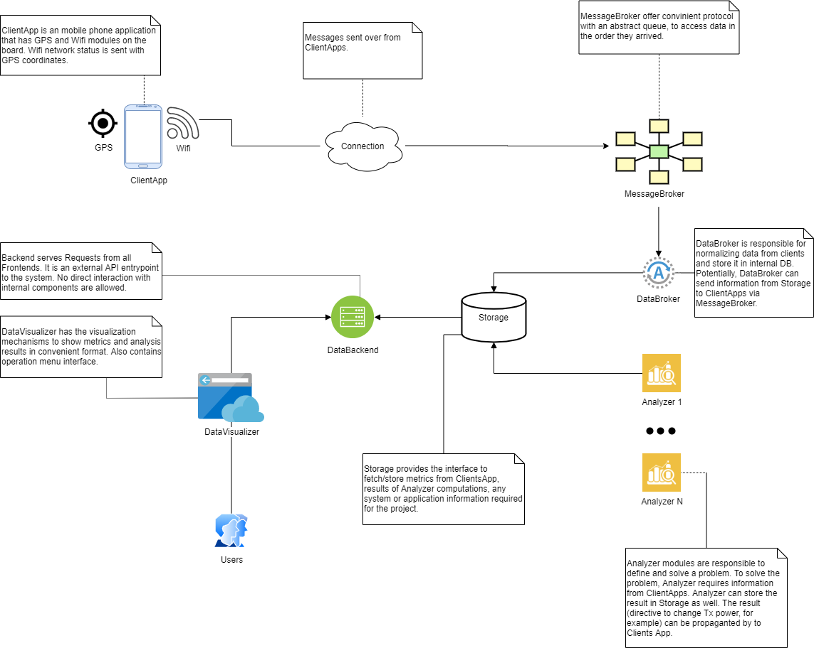

# Solution Strategy

## Conceptual Design

Conceptually, the GPS_Tracker framework consists of several abstract components

|Component|Description|
|---|---|
|Analyzer| An special entity that performs ETL operations on the data provided by ClientApp.|
|ClientApp|An entity installed on the user's phones that send information from the sensors.|
|MessageBroker|Protocol that the data from sensors is sent over.|
|DataBroker| A sensor data receiver part. The terminating side of MessageBroker. |
|DataBackend|A component that provides data access methods for the end clients. |
|DataVisualizer| An entity the user interacts with.|
|Storage|A program that stores sensor data reliably and has a well-defined access interface.|
Table: Conceptual Design components

{width=70%}

## Solution Approaches

### Performance

#### Goal

The messages receiving an operation performing must be accomplished as fast as possible.

#### Solution

To accomplish that, a protocol with very low latency but still reliable must be used. That must be a TCP/IP-based application protocol. There are two possible choices:

- TCP-based protocols for a reliable connection, but may have higher latency.
- UDP-based protocols for fast transmission without built-in reliable quality, but still has some of acknowledging mechanisms on the application level.  

Moreover, all components must be aware of to be written with efficient programming techniques and components. 

### Reliability

#### Goal

The communication sides must have a way to check if the message was received and interpreted correctly.

#### Solution 

For that, there must be checks in the end-to-end protocol, as well as checks in the backend that received information stored.

### Scalability

#### Goal

There must be an opportunity to easily increase the performance of the framework if required.

#### Solution

Publish/subscriber architecture pattern suits well the scalability requirement. Each component can be changed separately by different component regarding the proper interface implementation is done.

### Usability

#### Goal

The human-to-machine communication must have a user-friendly interface. There should be no problem with using the framework.

#### Solution

For better understanding, a proper documentation section is available for the user. The UI will be built using modern web technologies. That would give good user-experience.  

### Maintainability

#### Goal

Since the framework is quite complex, the additional complexity definitely will harm possible production installation.

#### Solution

To increase maintainability automation tools for development, deployment and maintenance are used. The framework is configured to provide easy-to-use instruments for the administrators.
