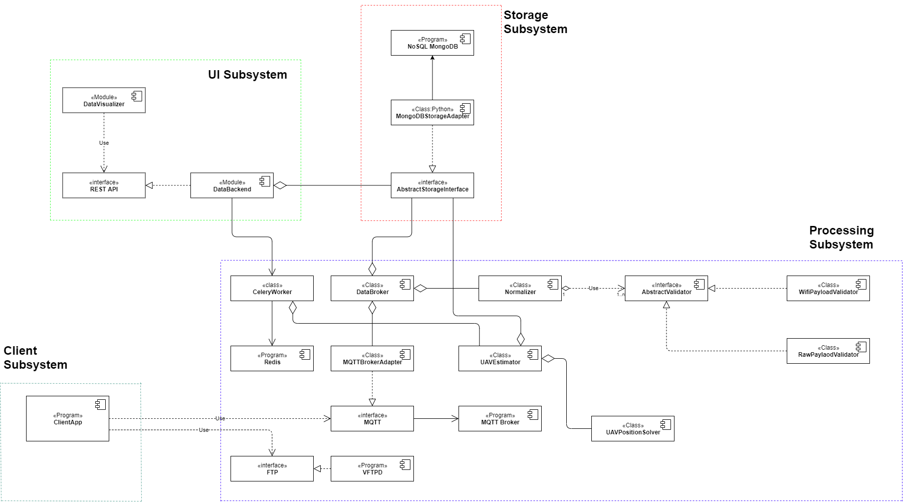
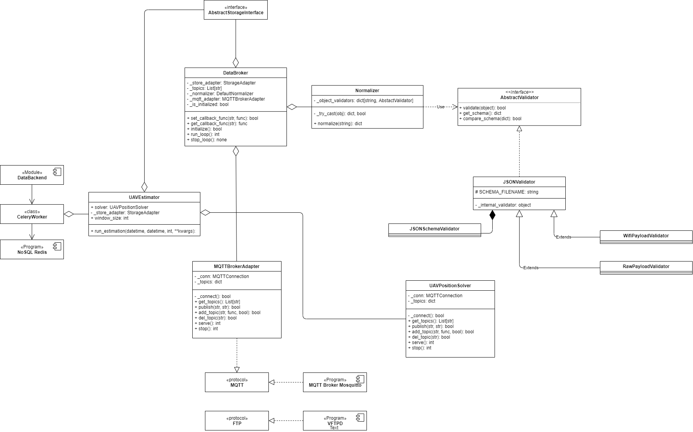
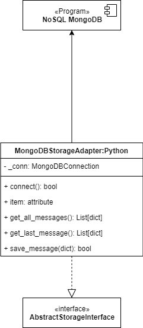
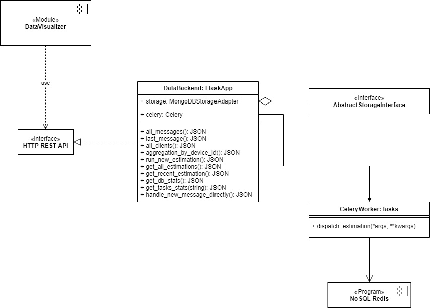

# Building Blocks

## Level 1. Main Scope and Context

The following diagram represents the main component in the framework divided by four subsystems:

- Client Subsystem
- Processing Subsystem
- Storage Subsystem
- UI Subsystem

### Motivation

The main motivation of this structure is the flexibility gaining by dividing the responsibility of implementation. Since the project is not so difficult, it involves a lot of different technologies and participants.

### Component consideration

The framework highly utilize already completed components and protocols. The most important off-the-shelf components here are:

1. Interfaces
    - **AbstractStorageAdapter** - specify methods of accessing the data in a strict format.
    - **AbstractValidator** - defines methods to check if a message has a valid telemetry data format.
    - **HTTP REST API** - defines methods on how to access the stored data through HTTP requests. 
2. Protocols  
    - **FTP** - used to measure uplink/downlink throughput.
    - **MQTT** - used to communicate the telemetry messages to the MQTT Broker.
3. Program
    - FTP-server - vsftpd - implementation of FTP server.
    - MQTT Broker - Eclipse Mosquitto - implementation of MQTT Protocol Broker.
    - NoSQL Database - MongoDB - a NoSQL database to store messages in BSON format.
    - NoSQL Database = Redis - a NoSQL database to cache the scheduled task list for Celery workers. 
    
## Level 2. Subsystems

### Processing Subsystem

#### Description

**Processing Subsystem** includes all functions to receive, prepare, transform, analyze and save the data. From the conceptual design phase it includes the following components:

- Analyzer
- MessageBroker
- DataBroker

These components are currently implemented in Python. Some code regarding placement optimization algorithms are private and provided to the production environment as installation packages of code written in Python also.

#### Open Issues

##### MQTT Broker doesn't hold message for the future 

Since we use quite simple MQTT protocol, the used implementation of MQTT Eclipso Mosquitto doesn't hold messages if there no subscribers for that message's topic. It requires at least one subscriber or set up properly QoS to guarantee that the message will be delivered and consumed properly.

One of the possibilities is to use more advanced publisher/subscriber systems such as Apache Kafka, but that has its drawbacks.

### Storage Subsystem

### Description

**Storage Subsystem** implements the function to access the stored data. It hides all complexity and preparation phases to get the information in the required form. This is the **Storage** component from the conceptual design phase.

Currently, only MongoDB is supported as final storage.

The MongoDB adapter is available only in Python currently.

### User Interface Subsystem

### Description

The DataBackend is written in Python. It has access to the Celery Worker infrastructure that requires Redis NoSQL DB to work. This is needed to properly register the task by the user, so it quite tangled.

The tasks are performed in the background so feedback of the web backend server is quite fast. The users can check the task status through REST API (not implemented, //TODO). 

This subsystem includes the components from the conceptual design phase:

- DataBackend
- DataVisualizer

The DataVisualizer is implemented as a web Single Page Application written with web technologies. 
