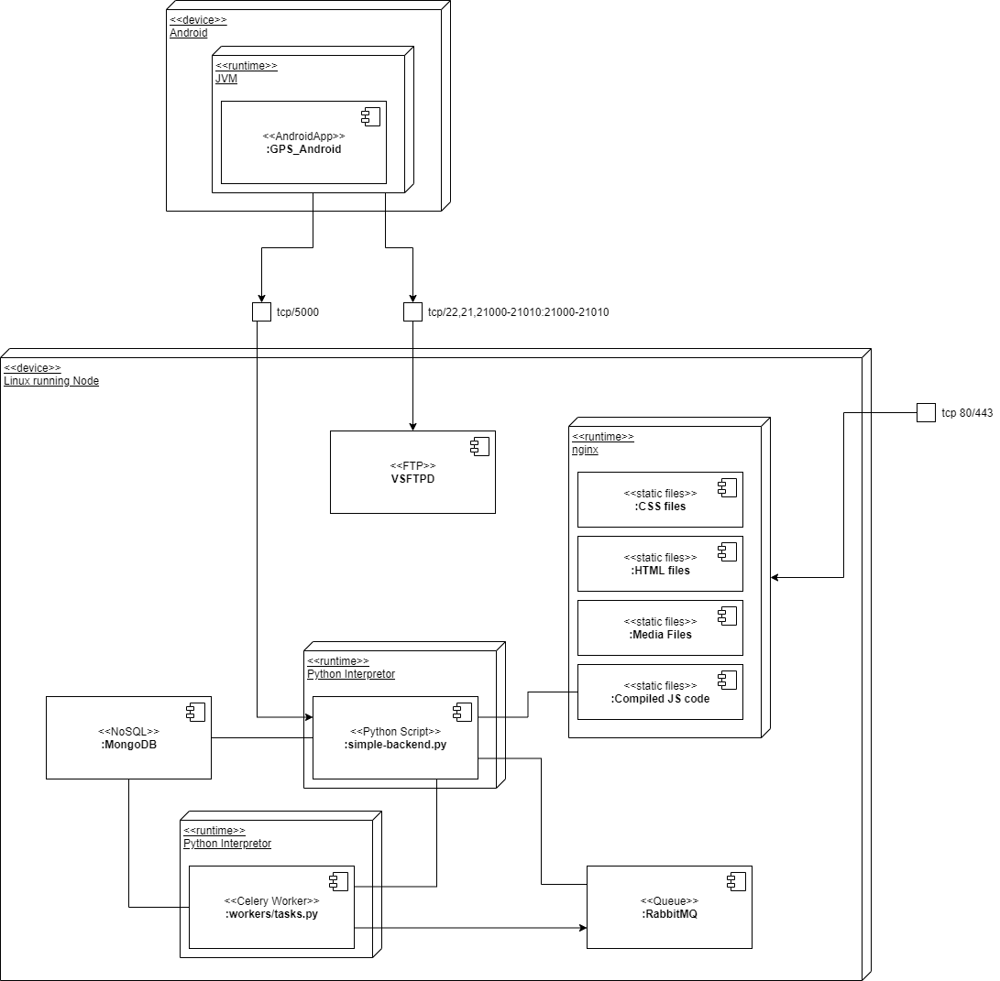

# Deployment View

## Requirements

### Operation System

#### GPS_Tracker

The framework is intended to run on Linux-based machines.

Tested OS:

- Debian 10/11
- CentOS 7

#### GPS_Android

The version of Android must be 4.0+ (API level 14)

#### GPS_Frontend

The user should use one of the modern version of web-browser HTML5-compatible:

- Google Chrome
- Mozilla Firefox
- Opera
- Apple Safari

The browser should allow running JavaScript files. 

### Hardware

There are no special hardware requirements.

#### GPS_Android

The Android phone must have WiFi and GPS adapters.

## Configuration

GPS_Tracker and GPS_Frontend can be configurated via a configuration file provided in the projects or via the OS environment variables.

For the exact configuration instructions please check each of the detailed project configuration sections.  
## Deployment Cases

Both GPS_Tracker and GPS_Frontend are designed to be easily deployed. There are possible two cases:

1. BareMetal Deployment - the administrator should be aware of manually starting the software elements, or configure the OS properly (via systemd, InitV scripts, etc.)
2. Docker container deployment - the projects provide Dockerimage description that can be started with `docker`, and a `docker-compose.yml` file to maintain the deployment phase more properly.

Each running element may be started on a separated machine as long as:

1. Proper configuration is performed
2. A network connection is available (NAT allowed, check for the ports if opened)

### Bare-Metal Deployment

### Containerized Deployment

