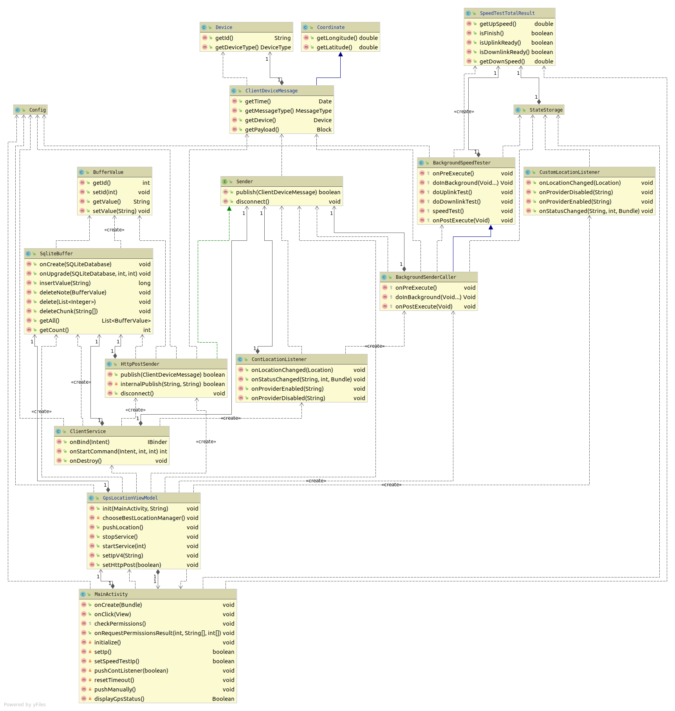

# Crosscutting concepts

### Android Class diagram

Android application implements MVVM architecture pattern and contains classes to collect, store and send data about location and wifi connection.

|Component|Description|
|---|---|
|MainActivity|Application entry point. This class contains data which will be initialize when application is started. `onCreate` method create view using `initialization()`, check permission using `checkPermissions()`, add handlers for every button and input field.|
|GpsLocationViewModel|Class for init and store location manager, creating background services using `startService`, call data sender and connection quality measurement tasks|
|StateStorage|Storage to store last knowing location and speed test results. `MainActivity` listen to this class and update data on User Interface if data was changed|
|Config|Class to store project configuration, such as sender configuration, timeout, min location change handling and etc.|
|ClientService|Background service which retrieve connection quality and send it with given periodicity|
|SqliteBuffer|Sqlite data storage for messages, which were not send to selected server due to connection error|
|BufferValue|Data Model for Sqlite buffer storage, which contains uniq id and message for sending|
|Sender|Interface for send client connection quality information using `publish()` method|
|HttpPostSender|Sender http connection implementation using post method. If connection is not reachable, all data is stored in `SqliteBuffer`|
|ContLocationListener|Listener for background ClientService, this class listen location changes with the given period and call background task to send data using given `Sender`|
|CustomLocationListener|Listener for send data manually using `push manually` button on User Interface, This listener update last knowing location in `StateStorage`|
|BackgroundSpeedTester|Task to make background uplink and downlink speed tests for wifi connection using given server ip|
|BackgroundSenderCaller|Background task for sending data|
|SpeedTestTotalResult|Data model, which contain uplink and dowlink test results|
|Device|Data model, which contains information about device|
|Coordinate|Data model, which contains coordinates |
|ClientDeviceMessage|Data model, which contains information about device, coordination and connection quality|

## GPS_Android

|Used approach|Reason|
|---|---|
|In case if a message cannot be sent it saved in the local SQLite database. In the next iteration, the app first tries to send saved messages | If there is a poor signal quality that will help to save the measurement to resend them after connection become better.|

## GPS_Tracker

|Used approach|Reason|
|---|---|
|Used Worker pattern| `Celery` workers allow to parallelize task execution. |
|MQTT Broker as Message Broker|MQTT Protocol is a lightweight reliable protocol for IoT intended application|
|MongoDB as storage for message|Use NoSQL MongoDB increase development velocity as well as performance, especially for JSON-formatted data.|

## GPS_Frontend

|Used approach|Reason|
|---|---|
|Backend is built on Flask Python Web Framework|Flask is a light, easy-to-use framework that requires a little effort but highly extensible.|
|Frontend app is built using Vue.js framework|Vue.js is perfectly suited for fast development but still has good design and extensions.|
