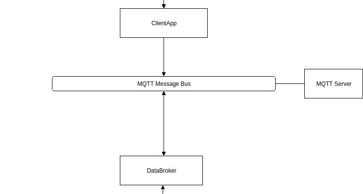

## Consideration on the protocol used to send data from GPS_Android

### Description

During the group study solution design it became clear our system needs **a mediator** which can control incoming messages. In particular:

- avoid loss of messages
- provide the availability to many devices at once
- provide smooth transmission to the processing subsystem

One of the initial requirements were to use UDP protocol.

{ width=50% }

### Decision

First, we decided to **NOT** use UDP-based protocol, especially raw UDP sockets:

- UDP connection are not reliable, you have to check the server receives messages correctly
- Calculation of metrics may be very time- and resource-consuming, so we cannot afford to lose the result of works by message losing
- A raw socket programmed software have to include additional checks, high-level integration is limited.

Therefore, we decided to use TCP-based protocols.  

First, we used MQTT protocol because it well-suited for IoT-based application. MQTT is useful for the reasons:

- fitting to criterion above
- reliability
- lightweight

However, the results in the first 3 experimental attempts have shown that MQTT is not adapted for the system. Consequently, we switched to HTTP protocol to send messages directly to backend server in GPS_Tracker.
 

### Status

Accepted, corrected

### Consequences

- A simple, supported and widely adapted protocol is used, further integration with TLS if needed
- Possible additional overhead due to headers (can be solved in HTTP/2)
