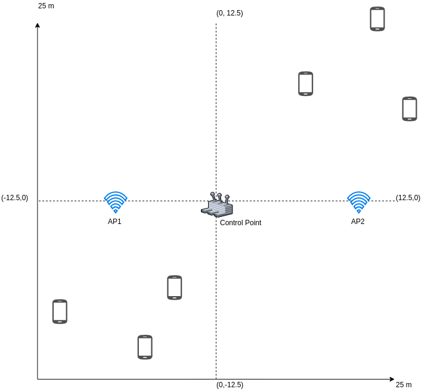

# Case-2. Uniform layout

In the second case, we want to put the APs at the same distance and line from the CnC.

Here, both **APs** are set right on the line between the quarter of UEs and quarter where AP was alone.

Signal quality and transmission rate in this configuration expected to increase compared to the previous case.

