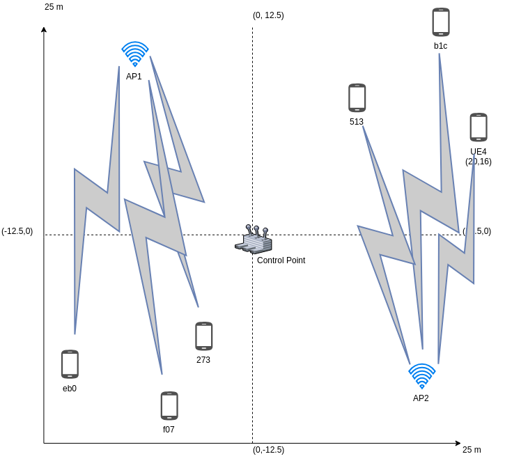

# Case-2. Near-optimal layout.

In the third case, the only changed things are the position of **APs**.

Each of them now is put in the middle of each group of 3 UEs, therefore they have the same distance to centers of each cluster.

Consequently, RSS and link transmission rate expected to increase

