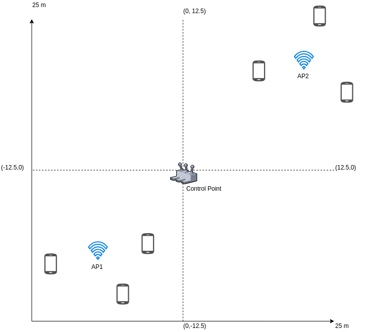

# Case-3. Sub-optimal layout

In the third case, the only changed things are the position of **APs**.

Each of them now is put in the middle of each group of 3 UEs, therefore they have the same distance to centers of each cluster.

This case expects to perform in the best signal quality and transmission rate.

