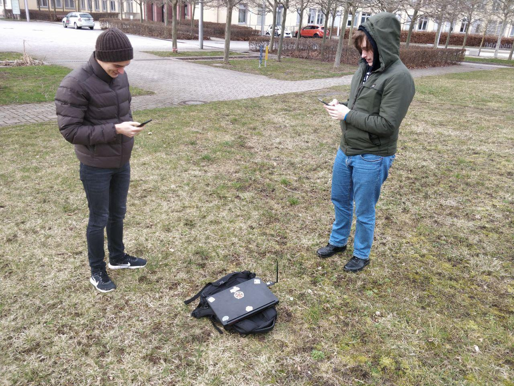

# Experiment-1. 22.02.2020

The second attempt took place on 22.02.2020.

This time the aim was to check how **updates** in different parts of the system behave in real condition:

- a new way to estimate load speed in-app
- possibility to read app logs right on UE
- improved front-end part

The goal did not include a full-scale experiment with as many devices involved, so there were 1 CnC, 1 AP, and 3 UEs with the same settings from the previous experiment but updated app.

## Weather conditions

- no precipitation
- clear sky
- no snow
- strong winds

## Procedure

Only one case (near-optimal) was performed.

All the UEs connections made successfully:

- deviceId assigned
- UE coordinates displayed

During the first half of the experiment time, after pressing 'push once' **upload/download speeds** were estimated and displayed, although the values seemed to be not realistic (300 000 kBit/s). The values were much smaller when CnC was not connected to the Internet.

Later, pressing 'push once' did not cause speed re-estimation, and logs contained error messages about issues related to the MQTT.

## Outcome

The second attempt was also not successful. We hadn't managed to solve the problem in telemetry data sending, some design proposals can be a solution for the next iteration.

As a result, we decided to:

- add logging to APs as well
- implement direct HTTP requests
