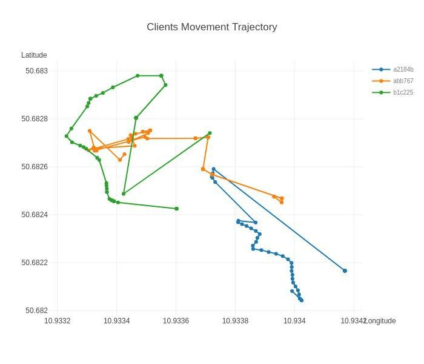

## Experiment 3. 07.02.2020 

Took place on 27.02.2020

This time the aim was to check how **2 major updates** of the Android app behave.

The *first* one concerned usage of HTTP requests instead of MQTT. The reason for it is that all previously detected issues were related to MQTT in one way or another.

The *second* update was about complete refactoring of the code. It included not only start following MVVM architectural pattern but also removing of redundant 'Connect' button, as well as real-time interaction with the app in the way that coordinates are being updated on the display when 'Push continuously' is enabled.

### Procedure

Due to the bad weather (heavy snowfall), we decided to experiment indoor (Mensa has enough space inside). 1 CnC, 1 AP, and 3 UEs took part.

All the UEs connections were made successfully:

- 'Push once' button pressed
- deviceId assigned
- UE coordinates were displayed

### Tips

As for 'Push continuously', it should be known in advance that the coordinates are updated on the display **only in the case of moving to some minimal delta** (10 centimeters)! And this is insured based on GPS values passed by the Android device.

To make sure that the connection is still alive, and the values are being transferred, it makes sense to check logging messages in logs/log.txt

### Outcome

All in all, the system finally started working as expected, and the meaningful set of data is collected:

{ width=50% }

{ width=50% }

{ width=50% }
