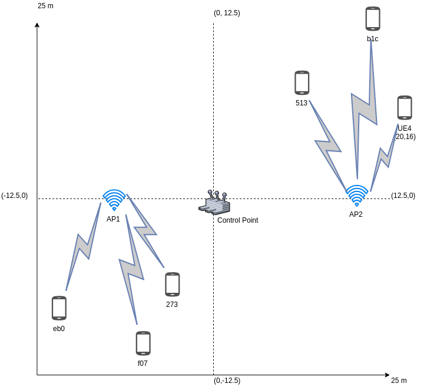
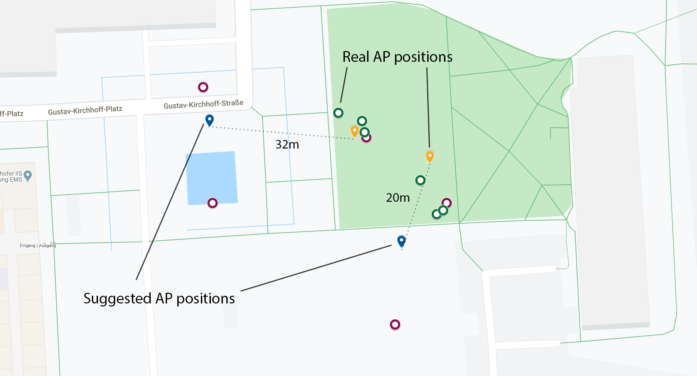

# Experiment 4. 03.03.2020

It took place on 03.03.2020. The weather condition is appropriate for running experiments, despite there was rain.

For the fourth attempt, we implement message sending only via HTTP. The main aim of the experiment is to try to place the UEs in three cases (sub-optimal, uniform, near-optimal). Phones forced to push their channel quality metric to the server for each case. On the server-side, GPS_Tracker tries to find optimal positions for UAVs supposing there are 2 AP is required.

We decided to reduce the area layout to 25x25 meters.

## Results

THe HTTP protocol helps us to receive messages more reliable, although there was a problem, e.g. the far from AP a UE is the less probable the message receiving. Tests in [experiment 3](06-attempt-03.md) showed the reliability of sending over HTTP. However, we decided to continue our experiment.

We found out that network speed measurement was not reliable, uplink tests throw the timeout exception in case of larger distance between a UE and used AP.

The measurements showed the following coordinates for the 6 UEs:

| Unique ID        | Coordinates               |
| ---------------- | ------------------------- |
| f072f812f48ce468 | (50.4056203, 10.5626057)  |
| eb0b54819c69cf0c | (50.4056230, 10.5626126)  |
| 27349a2cde6592df | (50.4056445, 10.5625865)  |
| 51336504999bc1ca | (50.40567855, 10.5625238) |
| b1c225280d0ed13f | (50.4056924, 10.5624943)  |

Table: Initial positions for UEs

The experiment is divided into four parts:

- Before 11:05 - suboptimal case
- 11:05 - 11:08 - uniform case
- 11:08 - 11:12 - near-optimal case
- 11:12 - 11:15 suboptimal to compare to the suggested positions

### Suboptimal case

{width=50%}

The first case is the most profitable from the signal quality point of view. The APs are implicitly located at the same distance from the connected UEs. The level of interference is low.

Despite the APs were located close to UEs, the RSS level varies markedly. However, only in this case the speed and signal quality measurement were the most stable among all cases.

### Uniform case

In this case, the APs are located with equal distance from the CnC on the same line.

Link measurement became more smooth, but the speed test failed sometimes.

### Near-optimal case

The third case simulates the situation where the APs are placed uniformly far from centers of UEs' clusters.

### Comparison between Suboptimal case, and the suggested positions

To check the validity of the UAVs layout optimization algorithm, we place the APs in a Suboptimal case position.

The given coordinates for **APs**:

| AP  | Coordinates              |
| --- | ------------------------ |
| AP1 | (50.4056741, 10.5625129) |
| AP2 | (50.4056339, 10.5625975) |

The coordinates for **27349a2cde6592df** and **51336504999bc1ca** overlap.

The most recent received coordinates for UEs used to schedule an optimization task with the following parameters:

- Number of clusters: 2
- Estimation method: "clustering"

Using of "simplex" method against two clusters is not possible, because that method for 2 clusters cannot converge, the produced result is unreliable.

The suggested optimal coordinates for **APs**:

| AP  | Real coordinates         | Optimal coordinates  |
| --- | ------------------------ | -------------------- |
| AP1 | (50.4056741, 10.5625129) | (50.68221, 10.94046) |
| AP2 | (50.4056339, 10.5625975) | (50.68245, 10.93986) |

"Clustering" algorithm performs simple K-means cluster calculation based on GPS coordinates for UEs. The result provides insights about that layout optimization algorithms relying solely on the coordinate input data can result in a biased solution.

### Pictures of experiment

{width=60%}

## Outcome

Finally, we have managed to test the framework and estimate an optimized position for UAVs which were represented by WiFi access points. The results showed that the framework, as well as optimization algorithms, should be redesigned and evaluated on updated data.
