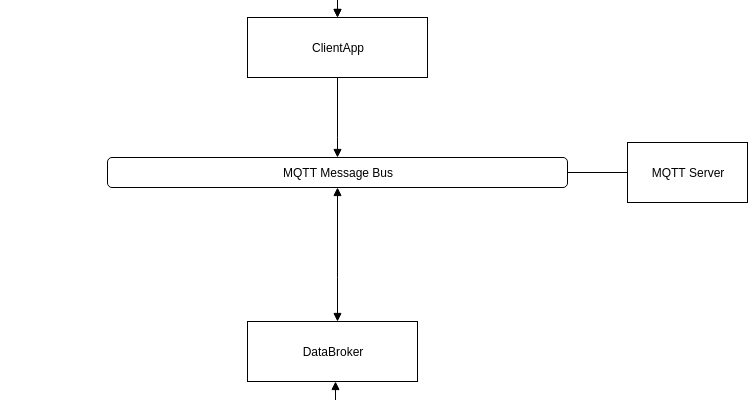

### Why MQTT protocol?

reliable, lightweight 

During the group study solution design it became clear that
our system needs **a mediator** which is able to 
control incoming messages. In particular:
- avoid loss of messages
- provide availability to many devices at once 
- provide smooth transmission to the processing subsystem

{ width=50% }

## Outcome
As a result, MQTT was selected for the reasons:
- fitting to criterion above
- reliability
- lightweight

However, the **alternative design** based on HTTP excluding MQTT
was implemented as well in order to be more flexible
during experimental part of the project.